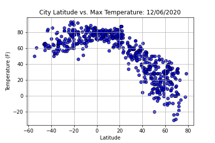
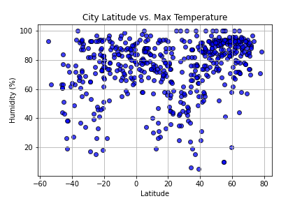
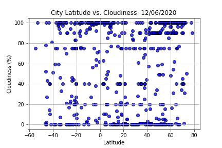
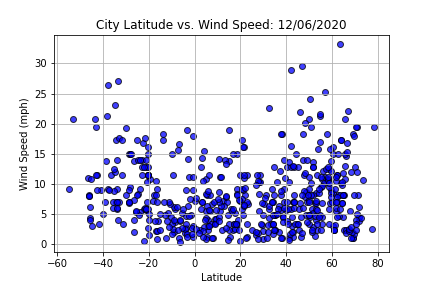
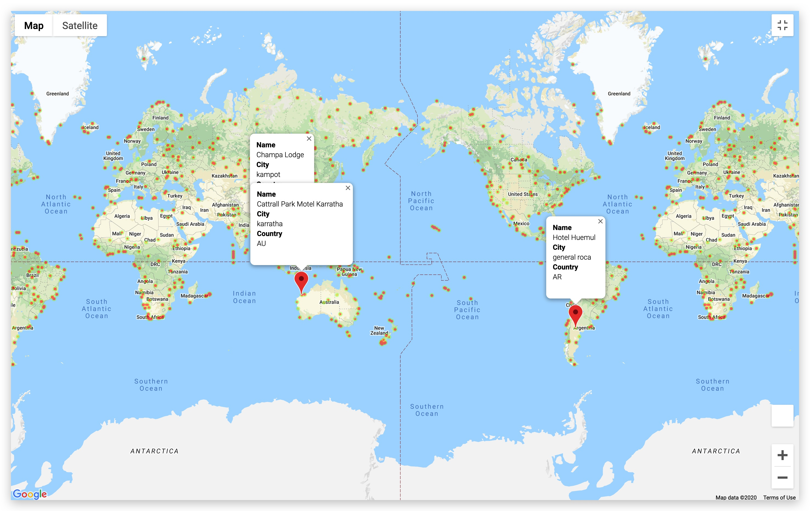

# python-api-challenge
What's the weather like near the equator? Using python requests, api calls, and json we find out!

****************************************************************
This project used python Pandas and the [OpenWeather API](http://openweather/api) to provide weather data for randomly generated cities using a python library, [citipy](https://pypi.org/project/citipy/). Once generated, the API call grabbed a variety of weather data about each location including: temperature, humidity, cloudiness, and wind speed. Once collected, I placed all of the data into a DataFrame for analysis.

### Part 1 - WeatherPy
*Analysis Included*

1. Scatter plots for: 
    * Latitude vs Temperature
    
    * Latitude vs Humidity
    
    * Latitude vs Cloudiness
    
    * Wind Speed
    
2. Linear regression of northern and southern hemispheres on: 
    * Latitudes vs
        * Temperature
            * There is a strong correlation in the northern hemisphere between temperature and latitude - the closer you get to the equator, the warmer the temperature becomes.
            * That correlation isn't as strong in the southern hemisphere, but it is apparent.
        * Humidity
            * There is a very weak correlation between latitude and humidity in both the northern and southern hemispheres.
        * Cloudiness
            * Very weak correlation, almost none, between cloudiness and latitudes in both the northern and southern hemispheres. 
        * Wind Speed 
            * There is a very weak correlation between wind speed and latitudes in both the north and south hemispheres.
            * That said, there appears (based on the dataset generated) to be a higher correlation between the two in the southern hemisphere - specifically as you get closer to the equater.

### Part 2 - VacationPy
For this part of the project I read in the csv I created from WeatherPy. Using the [Google Places API](https://developers.google.com/places/web-service/overview) I was able to look up my randomly generated cities by latitude and longitude using a for loop and .loc method and plot them on a google 'heat' map using Humidity as my weight marker. I then looked up the closest hotel and placed the specific response details into a DataFrame column and added it to my original DataFrame. 

Once I had my DataFrame completed I created my personal *ideal* weather conditions and filtered down (by dropping rows) the DataFrame using conditional statements. This left me with a minimal amount of cities that I was able to plot on my heat map and place markers on each plot showing the hotel information. As a bonus, I exported my *ideal* list of vacation cities for future reference.

Final heat map product:  

